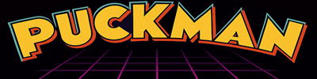

# PUCKMAN (Revamped)

A rebuild of the classic HTML5 **PUCKMAN** game.

Focuses on **modular architecture, deterministic collision handling, procedural level generation, and flexible input systems**, while keeping the original arcade gameplay intact.

Built entirely with **vanilla JavaScript and HTML5 Canvas**, with no frameworks or build steps required. Runs directly in modern browsers.

---

## Tech Stack
- Vanilla JavaScript (ES6+)
- HTML5 Canvas
- HTML5 Gamepad API
- No frameworks, bundlers, or build tools
- Runs in Chrome, Firefox, and Edge

---

## Core Systems & Features

### 1. Procedural Map & Level Generation
- Grid-based procedural map system with **walkable paths**
- Walls placed safely without overlapping player spawns or goals
- Difficulty scales with **level tiers**
- Configurable generation parameters:
  - `mapSafeMargin` – prevents spawns near borders
  - `mapLaneSpacing` – controls wall spacing
  - `mapEmptyChance` – balance of open space vs walls
  - `mapSpawnRadius` – protected area around player
- Optional tile color variation based on distance from map center
- Map and borders cached after generation for efficiency
- Ensures all goals are reachable
- Safe initialization prevents overlap with player, enemies, or map edges

---

### 2. Level Progression
- Infinite levels with **difficulty tiers**
- Goal count, enemy AI, and map density scale with level
- Score and level-specific modifiers applied automatically
- Progression triggered when all goals are collected
- Supports automatic reset and next-level transition

---

### 3. Goals & Objectives
- Configurable goal count per level
- Placement avoids walls, enemies, and player spawns
- Goal collection:
  - Increases score
  - Plays audio feedback
  - Advances game state
- Fully collision-aware with map and entity holders
- Supports dynamic repositioning if blocked

---

### 4. Player & Movement
- `Player` extends **GameObject**
- Keyboard support: WASD & Arrow keys
- Gamepad support via HTML5 Gamepad API
- Smooth movement with diagonal normalization
- Collision-aware movement prevents tunneling
- Shooting with cooldown support
- Interactions:
  - Goals → score and state update
  - Enemies → life reduction
- Handles runtime input changes without breaking movement

---

### 5. Enemy / NPC System
- `Enemy` extends **GameObject**
- AI states:
  - `ROAM`
  - `FOLLOW`
  - `STOP`
- Integrated with collision system
- Designed for easy extension with additional behaviors
- Movement respects map layout and player position
- Avoids goal and spawn conflicts

---

### 6. Input System
- Unified input for **keyboard + gamepad**
- Gamepad via HTML5 Gamepad API
- Per-frame input clearing to prevent stuck or repeated actions
- Clean separation between held inputs and one-shot presses
- Supports pause, state switching, and runtime toggle
- Prevents accidental browser scrolling or focus issues

---

### 7. Game States
- `INIT` – startup and splash screen
- `PLAY` – active gameplay
- `PAUSE` – paused state
- `WIN` – level complete
- `LOSE` – game over
- Each state manages its own update loop and rendering rules
- State transitions are deterministic and reset properly
- Guards prevent double-entry and timing race conditions

---

### 8. Collision System
- `GameObject` provides:
  - `getHitbox()`
  - `tryMoveWithCollision()`
- Utility functions:
  - `rectsCollide()`
  - `roughNear()`
  - `overlapsAny()`
  - `checkPlayerGameObjCollisions()`
- Handles collisions with map, player, enemies, and goals
- Optimized for performance
- Prevents tunneling and overlap glitches
- Works with both static and moving objects

---

### 9. HUD & Rendering
- Dynamic HUD placement based on canvas size
- Rendering pipeline:
  - Billboards / splash screens
  - Game objects (map, player, enemies, goals)
  - HUD (score, lives, level)
  - Text overlays
- Map and borders rendered once per level for efficiency
- Optional debug overlay shows hitboxes, entity positions, and runtime info
- Flexible layering allows easy addition of effects

---

### 10. Audio
- Audio pooling prevents playback issues
- Fully integrated with game state changes
- Designed for easy future expansion

---

### 11. Timers & Timing Control
- Custom game timer system replaces ad-hoc `setTimeout`
- Timers are centrally managed and updated via the main game loop
- Used for:
  - State transition delays
  - Game clock
- Prevents timing drift and state-related race conditions
- Makes timing behavior explicit and debuggable

---

### 12. Fullscreen & Display Handling
- Optional fullscreen mode
- Canvas dynamically resizes with window and fullscreen changes
- Maintains correct aspect ratio and HUD positioning
- Supports both embedded arcade layout and fullscreen play

---

### 13. Project Structure & Modularity
- Code split into focused files by responsibility:
  - Game loop
  - State handlers
  - Entities
  - Input
  - Collision
  - Timers
  - Rendering
- Reduces coupling between systems
- Makes debugging and refactoring safer
- Supports gradual evolution toward a lightweight game engine

---

### 14. Debug & Development
- Optional on-screen debug panel
- Hitbox visualization
- Safe initialization checks prevent race conditions
- Fixed-step game loop ensures consistent updates
- Console logging for debugging
- Modular structure allows replacing core systems without breaking others

---

## Design Principles
- **Explicit behavior** – predictable and testable
- **Modular systems** – minimal coupling
- **Deterministic collisions** – avoids glitches
- **Performance-aware** – optimized Canvas rendering
- **Debug-friendly** – easy to inspect and reason about
- **Extendable** – supports new entities, input, or map rules

---

## Future Work
- Expanded enemy AI behaviors
- Power-ups and modifiers
- High Score screen

---

## Notes
This project serves as both a **modernized PUCKMAN game** and a **testing environment for engine-level concepts**, including procedural generation, deterministic collisions, explicit state management, centralized timers, and dynamic fullscreen handling.
